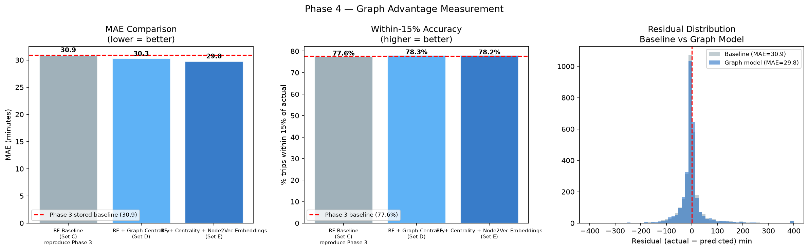
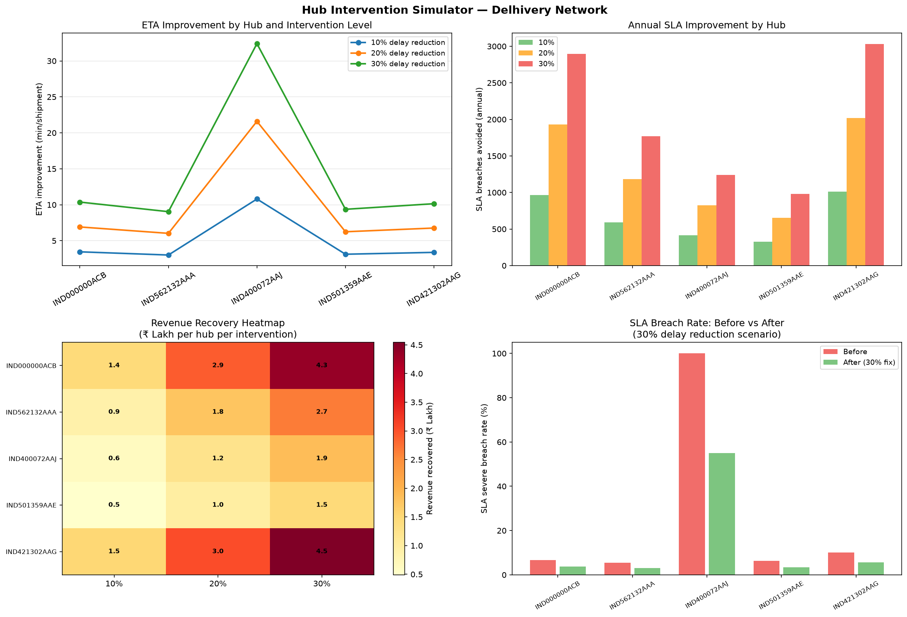

# Delhivery Logistics Network Intelligence


A Streamlit dashboard for finding ETA, corridor, and hub problems in a
logistics network. It combines a Random Forest ETA model with NetworkX graph
features, corridor risk scoring, delay propagation analysis, and a simple hub
intervention simulator.

Deployed dashboard: link coming soon.

## What it does

The analysis works at trip level after cleaning shipment segments. It covers:

1. ETA prediction and comparison with the OSRM baseline
2. Network bottleneck and corridor risk analysis
3. Delay propagation through downstream hubs
4. Hub intervention scenarios with estimated SLA and revenue impact

## Results

| Metric | Result |
| --- | ---: |
| Shipment segments after cleaning | 141,661 |
| Unique trips | 14,804 |
| Facilities | 1,657 |
| Corridors | 2,781 |
| Random Forest MAE | 30.95 min |
| Graph-enhanced Random Forest MAE | 29.81 min |
| Cross-validation MAE | 28.78 +/- 0.51 min |
| Graph validation p-value | 0.0065 |

The financial figures in the dashboard are estimates from the sample data,
not Delhivery financial results. The evidence files in `reports/evidence/`
show the assumptions behind those estimates.

## Dashboard preview






## Project layout

```text
app.py                         Streamlit dashboard
src/                           Data loading and analysis helpers
notebooks/                     Analysis notebooks by project phase
data/                          Shipment data used by the analysis
artifacts/                     Saved graph and model outputs
reports/evidence/              Small validation and assumption tables
assets/plots/                  Dashboard images
scripts/                       Evidence-pack generator
sql/                           Analytics queries and product views
requirements.txt               Dashboard dependencies
requirements-analysis.txt      Extra dependencies for rebuilding analysis outputs
```

Large local checkpoints and the virtual environment are not needed to run the
deployed fallback dashboard. They are also excluded from version control.

## Run locally

```bash
git clone https://github.com/iuday2005/Delhivery-logistics-network-intelligence-2.git
cd Delhivery-logistics-network-intelligence-2
pip install -r requirements.txt
streamlit run app.py
```

Then open `http://localhost:8501`.

To rebuild the evidence tables when the local checkpoints are available:

```powershell
pip install -r requirements-analysis.txt
python -B scripts/build_evidence_pack.py
```

Docker is also supported:

```bash
docker build -t delhivery-dashboard .
docker run -p 8501:8501 delhivery-dashboard
```

## Models and validation

The main model remains a Random Forest. Graph features include facility
centrality, bottleneck scores, embeddings, and source or destination network
features. Evaluation is done after trip aggregation so segments from the same
trip do not cross the train and test split.

The graph lift was also checked by rebuilding graph features from training
trips only. The resulting improvement was 0.91 minutes of MAE.

## Next steps

Useful extensions would be live data refresh, intervention cost tracking,
scheduled retraining, and daily monitoring of ETA error and corridor risk.

## Author

[iuday2005 on GitHub](https://github.com/iuday2005)
